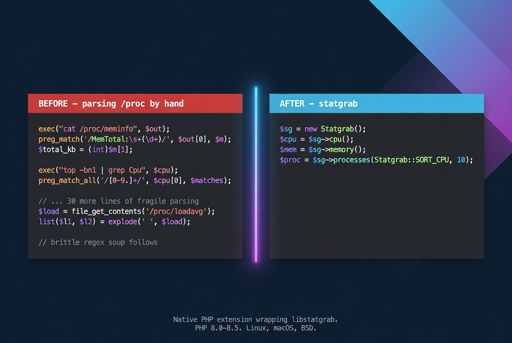

# statgrab

[](https://github.com/iliaal/statgrab/actions/workflows/tests.yml)
[](https://github.com/iliaal/statgrab/releases)
[](http://www.php.net/license/3_01.txt)
[](LICENSE.libstatgrab)
[](https://x.com/intent/follow?screen_name=iliaa)



A native PHP extension wrapping [libstatgrab](https://libstatgrab.org), the
cross-platform system-statistics library. Originally released to PECL
in 2006 against libstatgrab 0.6; the 2.0.0 line is a full
modernization for the PHP 8.0+ era against libstatgrab 0.92+.

Supports PHP 8.0 through 8.5 on glibc Linux, musl, macOS, and \*BSD.

## The Problem

Reading system stats from PHP usually means one of three bad options:

- Shell out to `top`, `vmstat`, `df`, `ps` and parse the output. Fragile on every OS update, and `fork`/`exec` overhead adds up if you poll on a schedule.
- Read `/proc` by hand. Linux-only. Forces hand-rolled regex for every statistic, and the format drifts between kernel releases.
- Pull in a heavy monitoring framework. Overkill if all you need is a CPU number for a health endpoint.

libstatgrab is the right primitive: cross-platform, well-tested, in the package manager of every modern Unix. But the 2006 PECL binding has not shipped a PHP 8 build, and its 2006 BC quirks (stringified counters, swapped page-stat keys, a flat `name_list` for users) made the old extension awkward even when you could compile it.

## ✨ Key Features

| Feature | Notes |
|---|---|
| Cross-platform | glibc Linux, musl, macOS, FreeBSD |
| Procedural + OO API | 2006 `sg_*` function names preserved; modern `Statgrab` class on top |
| Bundled libstatgrab option | Vendored 0.92.1 with a leak-fix patch; resulting `.so` has no runtime dependency on `libstatgrab.so` |
| Modern types | Counters returned as 64-bit `int`, not stringified numbers |
| Modern PHP errors | `E_WARNING` on library failure, `ArgumentCountError` for arg-count violations |
| BC-preserved 2006 names | Drop-in for callers of the original PECL extension, with the 2.0 BC notes documented below |

## 🛠️ Why native

The case for a native extension is the failure modes of the alternatives:

- `exec("top ...")` and friends fork a process per call. The overhead is real if you poll every few seconds, and the output format drifts between OS releases.
- Hand-parsing `/proc` ties you to Linux and to whatever the kernel decided to print this year. Each file (`/proc/meminfo`, `/proc/loadavg`, `/proc/diskstats`, `/proc/net/dev`) has its own format and edge cases.
- Calling out to a stats daemon adds a network hop and a daemon to deploy.

statgrab calls libstatgrab in-process. libstatgrab handles the per-OS path (Linux `/proc`, FreeBSD `kvm`, macOS `host_*` APIs) and exposes a single typed surface. The extension wraps that surface with no allocation per call beyond the result array.

## 🚀 Quick Start

### PIE (recommended on PHP 8.x)

[PIE](https://github.com/php/pie) is the PHP Foundation's PECL successor.
It installs from Packagist, builds against the active `php-config`, and
produces a loadable `.so`. Make sure libstatgrab is installed first
(see the From-source section below for the system package names), then:

```sh
pie install iliaal/statgrab
```

Then add `extension=statgrab` to your `php.ini`.

### PECL

The package remains in the PECL channel for legacy installers:

```sh
pecl install statgrab
```

### From source

```sh
sudo apt install libstatgrab-dev   # Debian/Ubuntu
# OR: brew install libstatgrab     # macOS
# OR: pkg install libstatgrab      # FreeBSD

phpize
./configure --with-statgrab
make
sudo make install
```

Then add `extension=statgrab` to your `php.ini`.

`config.m4` resolves libstatgrab through `pkg-config` first; if that
fails it falls back to a path probe (`/usr` and `/usr/local`). Pass
`--with-statgrab=<prefix>` to point at a custom install.

### Bundled libstatgrab (statically linked, leak-fixed)

The repo carries a vendored copy of libstatgrab 0.92.1 under
`vendor/libstatgrab/` with one local patch (see
`vendor/libstatgrab/LOCAL_PATCHES.md`) that fixes a process-exit leak
upstream hasn't released yet. To use it:

```sh
(cd vendor/libstatgrab && ./configure --enable-static --disable-shared --without-ncurses --with-pic && make)
phpize
./configure --with-statgrab=bundled
make
```

The resulting `.so` has no `libstatgrab.so` runtime dependency.

The vendored libstatgrab tree stays LGPL 2.1+ (see `LICENSE.libstatgrab`);
the extension code stays PHP-3.01 (see `LICENSE`). Dynamic-link or
static-link, neither license infects the other.

## API

### Procedural

The 2006 function names are preserved.

```php
sg_cpu_percent_usage(): array|false       // user/kernel/idle/iowait/swap/nice (%)
sg_cpu_totals(): array|false              // cumulative jiffies + ctx switches/syscalls/IRQs
sg_cpu_diff(): array|false                // jiffies since last call
sg_diskio_stats(): array|false            // [diskname => [read, written, time_frame]]
sg_diskio_stats_diff(): array|false
sg_fs_stats(): array|false                // mounted filesystems with size/used/inodes/...
sg_general_stats(): array|false           // os_name, hostname, uptime, ncpus, ...
sg_load_stats(): array|false              // min1, min5, min15
sg_memory_stats(): array|false            // total, free, used, cache (bytes)
sg_swap_stats(): array|false              // total, free, used (bytes)
sg_network_stats(): array|false           // [ifname => sent/received/packets/...]
sg_network_stats_diff(): array|false
sg_page_stats(): array|false              // pages_in, pages_out (cumulative)
sg_page_stats_diff(): array|false
sg_process_count(): array|false           // total, running, sleeping, stopped, zombie
sg_process_stats(?int $sort = null, int $limit = 0): array|false
sg_user_stats(): array|false              // [{login_name, device, pid, login_time, ...}]
sg_network_iface_stats(): array|false     // [ifname => {speed, duplex, active}]
```

### Object-oriented

```php
$sg = new Statgrab();
$sg->cpu();
$sg->host();
$sg->memory();
$sg->processes(Statgrab::SORT_CPU, 10);
$sg->disks(diff: true);
```

Class constants:

- `Statgrab::DUPLEX_FULL | DUPLEX_HALF | DUPLEX_UNKNOWN`
- `Statgrab::SORT_NAME | PID | UID | GID | SIZE | RES | CPU | TIME`
- `Statgrab::STATE_RUNNING | SLEEPING | STOPPED | ZOMBIE | UNKNOWN`

The `SG_*` global constants from 2006 are still defined for BC.

## Errors

Library-side errors emit `E_WARNING` with the libstatgrab error string
and code, and the function returns `false`. The OO surface follows the
same convention. Argument-count violations on no-arg functions throw
`ArgumentCountError` per modern PHP convention.

## Notable 2.0 BC breaks

- `sg_user_stats()` returns per-user records, not a flat array of
  usernames. The underlying `name_list` field was removed from
  libstatgrab 0.91+. Migrate callers to read `login_name` from each
  record.
- Numeric counters (memory totals, fs sizes, jiffies) are returned as
  `int` instead of stringified numbers. The 2006 release stringified
  via `snprintf("%lld")` because 32-bit PHP couldn't hold them; modern
  64-bit `zend_long` does.
- `sg_page_stats()` / `sg_page_stats_diff()` were swapped in 2006 and
  are now correct.
- `sg_process_stats()` fields `gid` and `egid` are now distinct from
  `uid` and `euid` (2006 had a copy-paste bug returning uid/euid for
  both).

See `CHANGELOG.md` for the full list.

## 🔗 PHP Performance Toolkit

Native PHP extensions for the kinds of work pure-PHP libraries handle slowly:

- **[php_excel](https://github.com/iliaal/php_excel)**: Excel I/O via LibXL.
- **[mdparser](https://github.com/iliaal/mdparser)**: CommonMark + GitHub Flavored Markdown via cmark-gfm.
- **[php_clickhouse](https://github.com/iliaal/php_clickhouse)**: native ClickHouse client via clickhouse-cpp.

## License

[PHP License 3.01](LICENSE).

---

[Follow @iliaa on X](https://x.com/iliaa) • [Blog](https://ilia.ws)

If this saved you from parsing /proc by hand, ⭐ star it!
