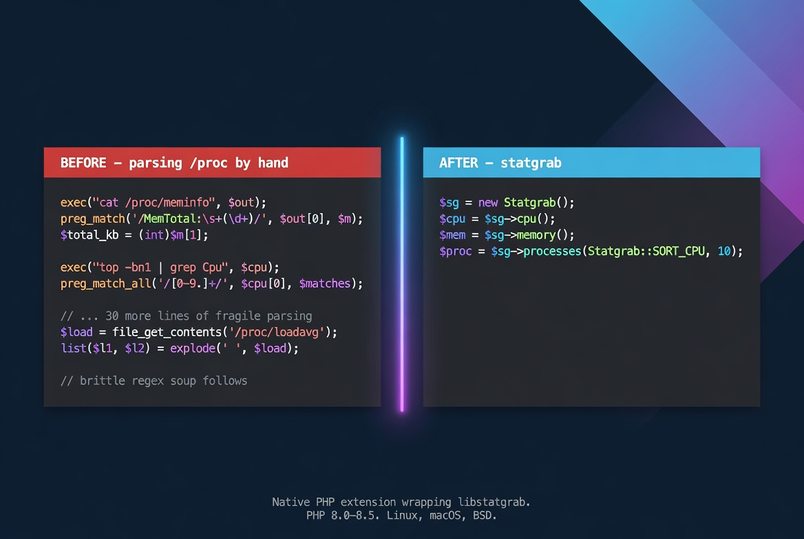

# statgrab

[](https://github.com/iliaal/statgrab/actions/workflows/tests.yml)
[](https://github.com/iliaal/statgrab/releases)
[](http://www.php.net/license/3_01.txt)
[](LICENSE.libstatgrab)
[](https://x.com/intent/follow?screen_name=iliaa)



A native PHP extension wrapping [libstatgrab](https://libstatgrab.org), the
cross-platform system-statistics library. Originally released to PECL
in 2006 against libstatgrab 0.6; the 2.0.0 line is a full
modernization for the PHP 8.0+ era against libstatgrab 0.92+.

Supports PHP 8.0 through 8.5 on glibc Linux, musl, macOS, and \*BSD.

## ⚖️ Why native

Without an extension, reading system stats from PHP means one of these:

- Shell out to `top`, `vmstat`, `df`, or `ps` and parse the output. Each call forks a process, which adds up if you poll every few seconds, and the output format drifts between OS releases.
- Parse `/proc` by hand. That's Linux-only, and each file (`/proc/meminfo`, `/proc/loadavg`, `/proc/diskstats`, `/proc/net/dev`) has its own format and edge cases.
- Query a stats daemon or monitoring framework. That adds a network hop and a daemon to deploy, which is overkill if all you need is a CPU number for a health endpoint.

statgrab calls libstatgrab in-process. libstatgrab handles the per-OS path (Linux `/proc`, FreeBSD `kvm`, macOS `host_*` APIs) and is packaged for Debian/Ubuntu, Homebrew, and FreeBSD. The 2006 PECL binding never shipped a PHP 8 build, and its quirks (stringified counters, swapped page-stat keys, a flat `name_list` for users) made it awkward even when you could compile it.

## ✨ Key features

| Feature | Notes |
|---|---|
| Cross-platform | glibc Linux, musl, macOS, FreeBSD |
| Procedural + OO API | 2006 `sg_*` function names preserved; modern `Statgrab` class on top |
| Bundled libstatgrab option | Vendored 0.92.1 with a leak-fix patch; resulting `.so` has no runtime dependency on `libstatgrab.so` |
| Modern types | Counters returned as 64-bit `int`, not stringified numbers |
| Modern PHP errors | `E_WARNING` on library failure, `ArgumentCountError` for arg-count violations |
| BC-preserved 2006 names | Drop-in for callers of the original PECL extension, except the 2.0 BC breaks listed below |

## 🚀 Quick start

### PIE (recommended on PHP 8.x)

[PIE](https://github.com/php/pie) is the PHP Foundation's PECL successor.
It installs from Packagist and builds against the active `php-config`.
Install libstatgrab first (package names are under From source), then:

```sh
pie install iliaal/statgrab
```

Then add `extension=statgrab` to your `php.ini`.

### PECL

statgrab is also on PECL:

```sh
pecl install statgrab
```

### From source

```sh
sudo apt install libstatgrab-dev   # Debian/Ubuntu
# OR: brew install libstatgrab     # macOS
# OR: pkg install libstatgrab      # FreeBSD

phpize
./configure --with-statgrab
make
sudo make install
```

Then add `extension=statgrab` to your `php.ini`.

`config.m4` finds libstatgrab through `pkg-config` first, then falls back
to a path probe (`/usr` and `/usr/local`). Pass
`--with-statgrab=<prefix>` to point at a custom install.

### Bundled libstatgrab (statically linked, leak-fixed)

The repo carries a vendored copy of libstatgrab 0.92.1 under
`vendor/libstatgrab/` with one local patch (see
`vendor/libstatgrab/LOCAL_PATCHES.md`) that fixes a process-exit leak
upstream hasn't released yet. A Git checkout does not include the generated
libstatgrab `configure` script, so generate it with `autoreconf` first.
This requires Autoconf, Automake, and Libtool in addition to the usual
C compiler, Make, and PHP development tools (on Debian/Ubuntu, install
`autoconf automake libtool php-dev build-essential pkg-config`). To use it:

```sh
(cd vendor/libstatgrab && autoreconf -fiv && \
  ./configure --enable-static --disable-shared --without-ncurses --with-pic && make)
phpize
./configure --with-statgrab=bundled
make
```

The resulting `.so` has no `libstatgrab.so` runtime dependency.

The vendored libstatgrab tree stays LGPL 2.1+ (see `LICENSE.libstatgrab`);
the extension code stays PHP-3.01 (see `LICENSE`). Dynamic-link or
static-link, neither license infects the other.

## API

### Procedural

The 2006 function names are preserved.

```php
sg_cpu_percent_usage(int $source = Statgrab::CPU_PERCENT_ENTIRE): array|false
//   $source: CPU_PERCENT_ENTIRE (cumulative since boot, default),
//            CPU_PERCENT_LAST_DIFF (since previous internal snapshot),
//            CPU_PERCENT_NEW_DIFF (since this call)
sg_cpu_totals(): array|false              // cumulative jiffies + ctx switches/syscalls/IRQs
sg_cpu_diff(): array|false                // jiffies since last call
sg_diskio_stats(): array|false            // [diskname => [read, written, time_frame]]
sg_diskio_stats_diff(): array|false
sg_fs_stats(): array|false                // mounted filesystems with size/used/inodes/...
sg_general_stats(): array|false           // os_name, hostname, uptime, ncpus, ...
sg_load_stats(): array|false              // min1, min5, min15
sg_memory_stats(): array|false            // total, free, used, cache (bytes)
sg_swap_stats(): array|false              // total, free, used (bytes)
sg_network_stats(): array|false           // [ifname => sent/received/packets/...]
sg_network_stats_diff(): array|false
sg_page_stats(): array|false              // pages_in, pages_out (cumulative)
sg_page_stats_diff(): array|false
sg_process_count(): array|false           // total, running, sleeping, stopped, zombie
sg_process_stats(?int $sort_order = null, int $num_entries = 0): array|false  // $num_entries 0 or > count returns all entries; negative throws ValueError
sg_user_stats(): array|false              // [{login_name, device, pid, login_time, ...}]
sg_network_iface_stats(): array|false     // [ifname => {speed, duplex, active}]
// 2.1 additions:
sg_valid_filesystems(): array|false       // list of fs-type strings libstatgrab treats as "real"
sg_set_valid_filesystems(array $filesystems): bool  // subsequent sg_fs_stats() only returns these fs_type values
sg_snapshot(): bool                       // re-seed libstatgrab's internal counters (call before a sliding-window sample)
sg_error_details(): array|false           // [code, errno, message, arg] for the pending libstatgrab error, or false if none
```

CPU results (`sg_cpu_percent_usage()`, `sg_cpu_totals()`, `sg_cpu_diff()`)
carry a `previous_run` key with the timestamp of the previous sample.

Rapid consecutive CPU diff samples can contain no elapsed CPU ticks. In
that case CPU percentages are `0.0` rather than NaN, so samples remain
JSON-encodable; wait between samples to measure meaningful utilization.

`sg_diskio_stats()` / `sg_diskio_stats_diff()`, `sg_network_stats()` /
`sg_network_stats_diff()`, and `sg_network_iface_stats()` key rows by
device/interface name; a duplicate name (multipath/LVM can repeat one)
falls back to a numeric key instead of overwriting the earlier row.

### Object-oriented

```php
$sg = new Statgrab();
$sg->cpu();                                // cpu(int $source = Statgrab::CPU_PERCENT_ENTIRE): array|false
$sg->host();
$sg->memory();
$sg->processes(Statgrab::SORT_CPU, 10);    // processes(?int $sort_order = null, int $num_entries = 0): array|false
$sg->disks(diff: true);
$sg->validFilesystems();                   // array|false: list of fs-type strings
$sg->setValidFilesystems(['ext4']);        // bool: subsequent filesystems() only returns these fs_type values
$sg->snapshot();                           // bool: re-seed libstatgrab's internal counters
$sg->errorDetails();                       // array|false: [code, errno, message, arg], or false if none pending
```

Class constants:

- `Statgrab::DUPLEX_FULL | DUPLEX_HALF | DUPLEX_UNKNOWN`
- `Statgrab::SORT_NAME | PID | UID | GID | SIZE | RES | CPU | TIME`
- `Statgrab::STATE_RUNNING | SLEEPING | STOPPED | ZOMBIE | UNKNOWN`
- `Statgrab::CPU_PERCENT_ENTIRE | LAST_DIFF | NEW_DIFF`: `$source` modes for `cpu()` / `sg_cpu_percent_usage()`
- `Statgrab::HOST_STATE_UNKNOWN | PHYSICAL | VIRTUAL_MACHINE | PARAVIRTUAL_MACHINE | HARDWARE_VIRTUALIZED`: interprets the `host_state` field on `host()` / `sg_general_stats()`
- `Statgrab::FS_UNKNOWN | REGULAR | SPECIAL | LOOPBACK | REMOTE | LOCAL | ALLTYPES`: bitmask values for the `device_type` field on `filesystems()` / `sg_fs_stats()`
- `Statgrab::ERROR_NONE | INVALID_ARGUMENT | OPEN | OPENDIR | PERMISSION | UNSUPPORTED`: common libstatgrab error codes to match on

## Errors

Library-side errors emit `E_WARNING` with the libstatgrab error string
and code, and the function returns `false`. The OO surface follows the
same convention. Argument-count violations on no-arg functions throw
`ArgumentCountError`.

`sg_set_valid_filesystems()` and `Statgrab::setValidFilesystems()` throw
instead of warning on bad input: `ValueError` on an empty array or an
entry containing NUL bytes, `TypeError` on a non-string entry. A
libstatgrab runtime failure from the setter (or any other stat call)
takes the usual warning and `false` path. Call `sg_error_details()` /
`Statgrab::errorDetails()` after a `false` return for the code, message,
errno, and arg.

## Notable 2.0 BC breaks

- `sg_user_stats()` returns per-user records, not a flat array of
  usernames. The underlying `name_list` field was removed from
  libstatgrab 0.91+. Migrate callers to read `login_name` from each
  record.
- Numeric counters (memory totals, fs sizes, jiffies) are returned as
  `int` instead of stringified numbers. The 2006 release stringified
  via `snprintf("%lld")` because 32-bit PHP couldn't hold them; modern
  64-bit `zend_long` does. On 32-bit PHP builds these fields still
  truncate above 2^31, so use a 64-bit build.
- `sg_page_stats()` / `sg_page_stats_diff()` were swapped in 2006 and
  are now correct.
- `sg_process_stats()` fields `gid` and `egid` are now distinct from
  `uid` and `euid` (2006 had a copy-paste bug returning uid/euid for
  both).

See `CHANGELOG.md` for the full list.

## 🔗 Native PHP extensions

Companion native PHP extensions:

- **[php_excel](https://github.com/iliaal/php_excel)**: native Excel I/O via LibXL. 7-10× faster than PhpSpreadsheet, full XLS/XLSX with formulas, formatting, and styling.
- **[mdparser](https://github.com/iliaal/mdparser)**: native CommonMark + GFM markdown parser via md4c. 15-30× faster than pure-PHP libraries.
- **[php_clickhouse](https://github.com/iliaal/php_clickhouse)**: native ClickHouse client speaking the wire protocol directly. Picks up where SeasClick left off.
- **[pdo_duckdb](https://github.com/iliaal/pdo_duckdb)**: PDO driver for DuckDB, analytical SQL in your PHP stack.
- **[fastjson](https://github.com/iliaal/fastjson)**: drop-in faster `ext/json`, backed by yyjson. 6× encode, 2.7× decode, 5× validate.
- **[phpser](https://github.com/iliaal/phpser)**: decoder-optimized binary serializer for cache workloads. Faster than igbinary on packed numerics and DTO batches.
- **[fast_uuid](https://github.com/iliaal/fast_uuid)**: high-throughput UUID generation (v1/v4/v7), batched CSPRNG and SIMD hex formatter, ramsey-compatible API.
- **[fastchart](https://github.com/iliaal/fastchart)**: native chart-rendering extension. 38 chart types behind one fluent OO API, SVG-canonical with PNG/JPG/WebP and optional PDF output.
- **[phonetic](https://github.com/iliaal/phonetic)**: native phonetic name matching (Double Metaphone, Beider-Morse, Daitch-Mokotoff, NYSIIS, Match Rating), the encoders PHP core lacks.

## License

[PHP License 3.01](LICENSE).

---

[Follow @iliaa on X](https://x.com/iliaa) • [Blog](https://ilia.ws)

If this saved you from parsing /proc by hand, ⭐ star it!
